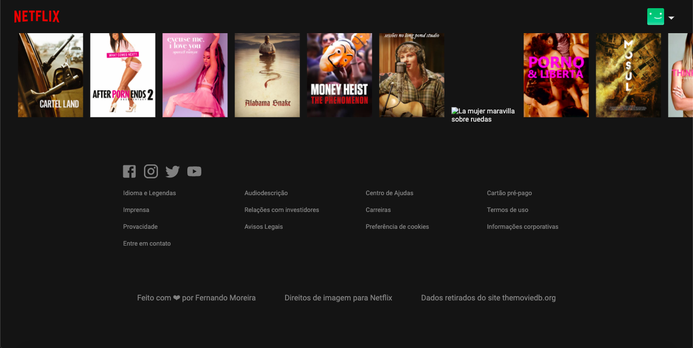

# Netflix Clone

Creating the entire interface of Netflix with ReactJS and getting the API from the website "themovidb.org" to make the project more real.

Feel free to access: https://netflix-myclone.netlify.app/

The main section has a featured movie that is recomended to the user. In this case, I didn't make the recomendation system as the used at Netflix, but it's sorted a movie or tv show randomly and it's showed in the screen. If the user reload the page, another movie (or tv show) will appear. It looks like this:
 

As the user rolls down, many movies will appear just like the Netflix website, in which they are separated by genre, Top rated, Recommended for You and Netflix Originals. It's impossible to have the movies for the user to watch, so the only things that exists is the image of each one. Because of that, when the user clicks on them nothing happens.
 

The footer section is composed by some links that doesn't lead to any other site, so if you click on them nothing happens. The social media icons can be clickable and each one lead to its respective websites:
 

## The API

The Api was taken from https://www.themoviedb.org.

## Credits

The image rights are for Netflix and the data from https://www.themoviedb.org.

